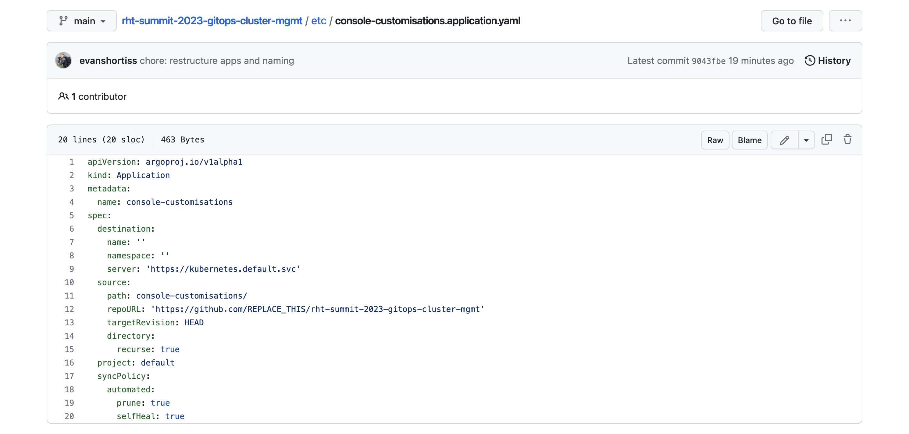

== Prepare the Application Configuration

**Red Hat OpenShift GitOps** is based on the upstream https://argo-cd.readthedocs.io/en/stable/[Argo CD] project. This means that the https://kubernetes.io/docs/concepts/extend-kubernetes/api-extension/custom-resources/[CRDs] (YAML files) used to manage your resources and applications using Argo CD can also be used with Red Hat OpenShift GitOps. 

The https://argo-cd.readthedocs.io/en/stable/operator-manual/declarative-setup/#applications[Application CRD] is provided by Argo CD to declaratively define, manage, and deploy applications on Kubernetes, and Kubernetes-based platforms such as Red Hat OpenShift. Using this CRD you can define the Git repository that contains the YAML files that define you'd like to synchronise to a Kubernetes cluster.

Let's take a look at an example:

. Open _your fork_ of the https://github.com/evanshortiss/rht-summit-2023-gitops-cluster-mgmt[lab repository] in a web browser.
. While still on your fork's GitHub page, press the period/dot key to open GitHub's web-based IDE.
. Find and open the *console-customisations/application.yaml* file. 
+

. This file defines an *Application*. Some notable fields include:
    * `spec.destination.server` - The target Kubernetes cluster. This Application will sync against the Kubernetes API in the same cluster that's running Red Hat OpenShift GitOps, i.e your OpenShift cluster.
    * `spec.source.repoURL` - Defines the Git repository that contains the resources that should be synchronised the the Kubernetes cluster specified in `spec.destination.server`.
    * `spec.syncPolicy` - Specifies rules for the synchronisation behaviour. In this case, we want to automatically sync once per minute, remove resources (`prune`) if they've been removed from the Git repository, and enable self-healing (`selfHeal`) so our cluster state always matches what's specified in the Git repository.
. Use the GitHub editor to modify the `spec.source.repoURL` to use your repository's URL, i.e edit the username portion of the URL.
. Commit and push the the change:
    * Select the **Source Control** section from the side-menu in the GitHub editor.
    * Enter a commit mesage in the text box.
    * Click the **Commit & Push** button.
. Verify your changes have been pushed by returning to your fork of the GitHub repository and checking that the latest commit matches your commit message.

== Create an Argo CD Application using the Argo CD UI

Now that you have an *application.yaml* file pointing to resources in your own Git repository, it's easy to create this Application using the Argo CD dashboard.

. Return to the Argo CD dashboard. If you've forgotten how to access it, re-read the *Accessing Argo CD Dashboard* section of this workshop.
. Click the **New App** or **Create Application** button. A form will appear. You could use this form to define the Application. Take a moment to examine the options, then move to the next step.
. Click the **Edit as YAML** button.
. Replace the YAML content with the contents of your *console-customisations/application.yaml* from your GitHub repository, and click **Save**.
. Finally, click the **Create** button.

The Application will appear as a new tile named *console-customisations* in the Argo CD Dashboard, and should report both *Healthy* and *Synced* statuses. 

Click on the tile to view the Application details. You should see a *welcome-banner* resource of type *consolenotification*.

image:images/ex3.argo-console-customisations.png[]

== Observing the Effects of your Application

You might be wondering what creating your Application in Argo CD achieved. If you return to the OpenShift Web Console it should be displaying a new banner at the top of the screen. 

This is the result of the Argo CD Application synchronising the resources in the *console-customisations/resources* directory of your Git repository to the OpenShift cluster. Specifically, it synchronised a https://access.redhat.com/documentation/en-us/openshift_container_platform/4.12/html/web_console/customizing-web-console#creating-custom-notification-banners_customizing-web-console[ConsoleNotification CR] to the cluster.

Try changing the notification message

. Open the *console-customisations/resources/welcome-banner.yaml* in the GitHub IDE.
. Edit the `spec.text` to read `Fáilte chuig Red Hat Summit 2023!`, or some similar message of your choosing.
. Use the **Source Control** section of the GitHub IDE to enter a commit message, then press **Commit & Push**.

Verify that your changes are synced to the OpenShift cluster:

. Return to the Argo CD Dashboard and select the *console-customisations* application.
. Observe the **Last Sync Result** section. Depending on your timing it will display your latest commit message, or a prior commit message.
. If your latest commit message isn't shown you can either wait up to a minute for Argo CD to perform a synchronisation, or use the **Refresh** button to manually check for changes and have Argo CD synchronise the change.

Once the latest commit has been synced you should see your new message displayed at the top of the **OpenShift Web Console**.

== Summary

Congratulations! You learned:

* About the *Application* CR provided by OpenShift GitOps.
* How to create an *Application* from the Argo CD dashboard using the form, or *Application* CR YAML.
* That YAML resources can be synchronised to the OpenShift cluster automatically by OpenShift GitOps.
* That the OpenShift Web Console can be customised using https://access.redhat.com/documentation/en-us/openshift_container_platform/4.12/html/web_console/customizing-web-console#creating-custom-notification-banners_customizing-web-console[ConsoleNotification] and other CRs.