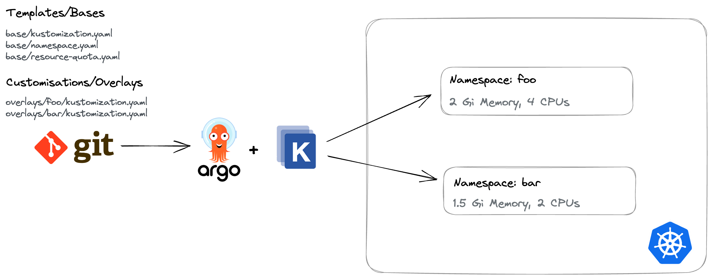
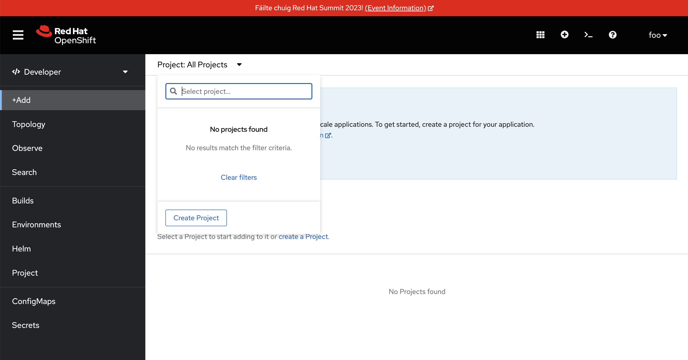

https://kubernetes.io/docs/concepts/overview/working-with-objects/namespaces/[Namespaces] can be used to provide isolation, and divide resources between different teams within a Kubernetes cluster. For example, two teams could each be given a Namespace within a cluster to deploy their applications. Each Namespace can have a set amount of CPU and memory allocated to it depending on the requirements of the software each team is building and deploying. The members of each team might only have access to their own Namespace.

In this section, you'll create two Namespaces based on a shared template. Of course you'll want each Namespace to have a unique name, and custom https://kubernetes.io/docs/concepts/policy/resource-quotas/[ResourceQuotas] and https://kubernetes.io/docs/concepts/policy/limit-range/[LimitRanges] depending on the workloads being deployed within them. You'll learn how to extend and patch YAML files using https://kustomize.io/[Kustomise]. Argo CD supports both Kustomize and Helm for scenarios where generating YAML is necessary.

Another use-case is patching resources based on the target environment. This example from the Kustomize website shows how a Deployment's replica count can be scaled out depending on the target environment.

image:images/ex4.kustomize.png[]

== Examine the Base Resources

Since you'll be using Kustomize to build out your Namespaces based on a shared template, the repository you forked has included those files to save some time.

. Navigate to the GitHub IDE for your repository and open the _namespaces/resources/base_ folder.
. Take a look at the _namespace.yaml_ and _resource-quota.yaml_ files. These are regular resources that could be applied to a Kubernetes/OpenShift cluster.
+
[NOTE]
====
The `argocd.argoproj.io/sync-wave` annotations on the YAML resources control the order in which they will be applied by Argo CD. This concept is known as https://argo-cd.readthedocs.io/en/stable/user-guide/sync-waves/[Sync Waves]. Being able to utilise Sync Waves is important, since the Namespace needs to exist before other resources can be applied within it for example.
====
. Open the _namespaces/resources/base/kustomization.yaml_ file. This file references the _namespace.yaml_ and _resource-quota.yaml_ files.

These files are referred to as *bases* or the *base* files to be used by Kustomize. In the next steps you'll define *overlays* that can add to, remove from, and update the base configuration(s).

== Define a Namespace using Overlays

. Navigate to the GitHub IDE for your repository.
. Create a new folder named `project-foo` in _namespaces/resources/overlays/_. This folder will contain your namespace configuration.
. Create a file named `kustomization.yaml` in the _namespaces/resources/overlays/project-foo_ folder.
. Place the following content in _namespaces/resources/overlays/project-foo/kustomization.yaml_. This will use the base files, but replace the default namespace value with `project-foo`:
+
[source,yaml]
----
apiVersion: kustomize.config.k8s.io/v1beta1
kind: Kustomization

namespace: project-foo
bases:
- ../../base

patches:
- target:
    kind: Namespace
    name: for-replacement
  patch: |-
    - op: replace
      path: /metadata/name
      value: project-foo
----
. Create another file named `kustomization.yaml` in the _namespaces/resources/overlays/_ folder, and place the following content inside:
+
[source,yaml]
----
bases:
- ./project-foo
----
. The end result will be two files like so:
+
image:images/ex4.github-ide-namespace-files.png[]
. Edit `spec.source.repoURL` in the _namespaces/application.yaml_ file to point to your repository.
+
[NOTE]
====
The `spec.source.path` has the value `namespaces/resources/overlays/`. This means the Argo CD application will traverse the overlays directory, find the *kustomization.yaml*, and use Kustomize to generate YAML to apply to the OpenShift cluster.
====
. Use the **Source Control** section of the GitHub IDE to enter a commit message, then press **Commit & Push**.

You now have everything you need to have Argo CD synchronise files and create a Namespace.

== Create your Argo CD Application from a Terminal

You'll create a new Argo CD Application to manage your namespaces using the `oc` or `kubectl`:

. Login to your OpenShift cluster in your web browser.
. Open the **Web Terminal** using the **>_** icon in the top-right corner of the **OpenShift Web Console**.
. Execute the following commands to create your Argo CD Application that will create and manage your Namespace.
+
[source,bash]
----
export GITHUB_USERNAME=REPLACE_THIS
export GITHUB_URL="https://raw.githubusercontent.com/$GITHUB_USERNAME/rht-summit-2023-gitops-cluster-mgmt/main/namespaces/application.yaml"

oc apply -f $GITHUB_URL -n openshift-gitops
----
. Open the Argo CD dashboard. It should report that the *managed-namespaces* application is "OutOfSync".
. Select the *managed-namespaces* Application tile.
+

. Click the *Sync Status* button to reveal a detailed error message.

The synchronisation failed because the https://kubernetes.io/docs/concepts/security/service-accounts/[Service Account] used by Argo CD to communicate the the Kubernetes/OpenShift API doesn't have the necessary permissions to manage ResourceQuotas and LimitRanges.

This class of error can be addressed by explicitly granting the Argo CD Service Account the required permissions to manage resources at the cluster-level using https://kubernetes.io/docs/reference/access-authn-authz/rbac/[ClusterRoles and ClusterRoleBindings]. 

== Granting Cluster-Level Permissions to Argo CD

Instead of carefully crafting a ClusterRole and ClusterRoleBinding, you'll save time in this lab by simply granting the `cluster-admin` role to the Argo CD Service Account:

. Login to the OpenShift Web Console.
. Open the OpenShift Web Terminal.
. Use the OpenShift CLI to bind the _cluster-admin_ role to the Argo CD Service Account by executing this command:
+
[source,bash]
----
oc adm policy add-cluster-role-to-user cluster-admin system:serviceaccount:openshift-gitops:openshift-gitops-argocd-application-controller
----
. Return to the Argo CD dashboard, and select the *managed-namespaces* Application.
. Manually trigger a sync by clicking the *Sync* button, accepting the default parameters, and clicking the *Synchronise* button. 

The Application will report *Healthy* and *Synced* status. This is because the Argo CD Service Account was able to synchronise all the resources thanks to having cluster administrative privileges. 

== Accessing your Namespace as a Non-Admin User

At this point, you've successfully created a Namespace by synchronising resources using Argo CD. Verify that you can access it:

. Login to the OpenShift Web Console.
. Select the *Administrator* perspective.
. Scroll down and find the *Home > Projects* section using the side-menu.
+
[NOTE]
====
A Project in OpenShift is a Kubernetes Namespace with some extra annotations. For all intents and purposes, you can treat "Project" as analogous to "Namespace". 
====
. Find the `project-foo` Namespace as shown.
+
image:images/ex4.openshit-ui-foo-namespace.png[]

Great! Now try doing the same thing again, but as a user without _cluster-admin_ permissions:

. Log out of the OpenShift Web Console by clicking your username in the top-right corner, and clicking the *Log out* link that appears.
. From the OpenShift login screen select *standard-users*, then login using:
    * Username: `foo`
    * Password: `foopassword`
. You should be redirected to the OpenShift Web Console. The *Developer Perspective* will be displayed by default.
. Dismiss the guided tour popup that appears.
. Click the Project dropdown, and note that the *foo* user is unable to see any projects!

You'll need to grant some permissions to the user named *foo* if they want to view the Namespace you just created. You can grant roles to users for a specific Namespace using a https://docs.openshift.com/container-platform/4.12/rest_api/role_apis/rolebinding-authorization-openshift-io-v1.html[RoleBinding]:

. Open your fork of the lab GitHub repository, and open the GitHub editor using the period/dot shortcut key. 
. Create a file named _role.yaml_ in the _namespaces/resources/overlays/project-foo_ directory, and add the following content to the file:
+
[source,yaml]
----
apiVersion: rbac.authorization.k8s.io/v1
kind: RoleBinding
metadata:
  name: foo-editors
  namespace: project-foo
roleRef:
  # Reference the standard editor role
  apiGroup: rbac.authorization.k8s.io
  kind: ClusterRole
  name: edit
subjects:
  # Make user "foo" a subject of this role, thus granting
  # them edit access in the project-foo namespace
  - kind: User
    name: foo
    namespace: project-foo
----
. Update _namespaces/resources/overlays/project-foo/kustomization.yaml_ file to reference the new _role.yaml_ file:
+
[source,yaml]
----
bases:
- ../../base
- role.yaml
----
. The resulting files should look like this:
+
image:images/ex4.github-ide-role-namespace.png[]
. Commit and push the change using the *Source Control* section of the GitHub editor.
. Return to the Argo CD dashboard and wait for the *managed-namespaces* project to synchronise, or use the *Refresh* button to trigger a Git pull and synchronisation.

The *foo* user should now be able to view and interact with the *project-foo* namespace:

image:images/ex4.openshift-ui-foo-projects.png[]

== Summary

Congratulations! You learned how to:

* Use Kustomize to create resources from YAML templates.
* Create Argo CD Applications directly from the terminal using `kubectl`/`oc`.
* Grant permissions to the Argo CD Service Account.
* Manage user permissions using Roles and RoleBindings synchronised via Argo CD.