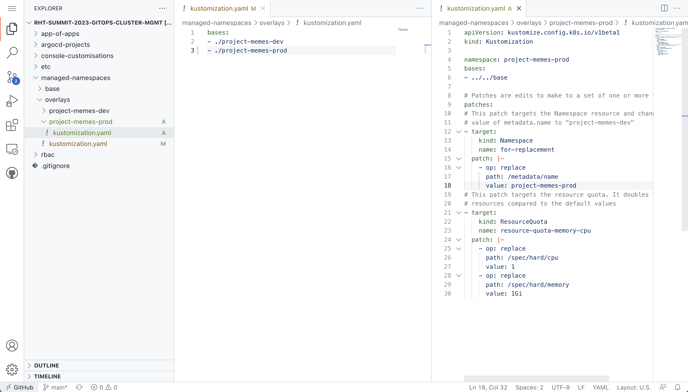
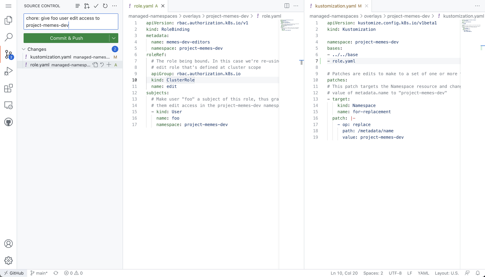

// Managing Namespaces using OpenShift GitOps
⏱️ _Estimated Time: 20 Minutes_

👨‍💻 _Role: Cluster Administrator_

https://kubernetes.io/docs/concepts/overview/working-with-objects/namespaces/[Namespaces] can be used to provide isolation, and divide resources between different teams within a Kubernetes cluster. For example, two teams could each be given a Namespace within a cluster to deploy their applications. Each Namespace can have a set amount of CPU and memory allocated to it depending on the requirements of the software each team is building and deploying. The members of each team might only have access to their own Namespace and no additional namespaces.

In this section, you'll create two Namespaces based on a shared template. Of course you'll want each Namespace to have a unique name, and custom https://kubernetes.io/docs/concepts/policy/resource-quotas/[ResourceQuotas] and https://kubernetes.io/docs/concepts/policy/limit-range/[LimitRanges] depending on the workloads being deployed within them. You'll learn how to extend and patch YAML files using https://kustomize.io/[Kustomise]. Argo CD supports both Kustomize and Helm for scenarios where templating YAML is necessary.

image:images/ex4.argo-kustomize-example.png[]

Another use-case is patching resources based on the target environment. This example from the Kustomize website shows how a Deployment's replica count can be scaled out depending on the target environment.

image:images/ex4.kustomize.png[]

== Examine the Base Resources

You'll be using Kustomize to build out your Namespaces based on a shared template. The repository you forked has included the template files to save some time. 

. Navigate to your fork of the GitHub repository and open the _managed-namespaces/base_ folder.
. Take a look at the _namespace.yaml_ and _resource-quota.yaml_ files. These are resources that can be applied to a Kubernetes/OpenShift cluster.
+
[NOTE]
====
The `argocd.argoproj.io/sync-wave` annotations on the YAML resources control the order in which they will be applied by Argo CD. This concept is known as https://argo-cd.readthedocs.io/en/stable/user-guide/sync-waves/[Sync Waves]. Utilising Sync Waves is important, since the Namespace needs to exist before other resources can be applied within it.
====
. Open the _managed-namespaces/base/kustomization.yaml_ file. This file references the _namespace.yaml_ and _resource-quota.yaml_ files.

These files are referred to as *bases* or the *base* files to be used by Kustomize. In the next steps you'll define *overlays* that extend/modify the base configuration(s).

== Define a Namespace using Overlays

A Namespace is already defined in the _managed-namespaces/overlays/project-memes-dev_ folder. You'll use this as a template to make a second Namespace:

. Navigate to your fork of the GitHub repository.
. Press the period/dot key to open GitHub's web-based text editor.
. Create a *folder* named `project-memes-prod` inside the _managed-namespaces/overlays/_ folder. This folder will contain your Namespace configuration.
. Create a *file* named `kustomization.yaml` inside your _managed-namespaces/overlays/project-memes-prod_ folder.
+

. Place the following content in _managed-namespaces/overlays/project-memes-prod/kustomization.yaml_. This will use the base files, but replace the default Namespace value and double the ResourceQuota values:
+
[source,yaml]
----
apiVersion: kustomize.config.k8s.io/v1beta1
kind: Kustomization

namespace: project-memes-prod
bases:
- ../../base

# Patches are edits to make to a set of one or more targets
patches:
# This patch targets the Namespace resource and changes the
# value of metadata.name to "project-memes-prod"
- target:
    kind: Namespace
    name: for-replacement
  patch: |-
    - op: replace
      path: /metadata/name
      value: project-memes-prod
# This patch targets the resource quota. It doubles the available
# resources compared to the default values
- target:
    kind: ResourceQuota
    name: resource-quota-memory-cpu
  patch: |-
    - op: replace
      path: /spec/hard/cpu
      value: 1
    - op: replace
      path: /spec/hard/memory
      value: 1Gi
----
. Edit the `kustomization.yaml` file in the _managed-namespaces/overlays/_ folder to reference your new Namespace configuration:
+
[source,yaml]
----
bases:
- ./project-memes-dev
- ./project-memes-prod
----
. The end result will be a new _managed-namespaces/overlays/project-memes-prod/kustomization.yaml_ file, and the existing _managed-namespaces/overlays/kustomize.yaml_ is updated to reference the new _project-memes-prod/_ folder as shown:
+

. Edit the `spec.source.repoURL` in _etc/managed-namesapces.application.yaml_ to point to your fork's URL.
+

. Use the **Source Control* section of the GitHub editor to enter a commit message, then press *Commit & Push*.
+

You now have two Namespaces ready to be synchronised and managed by Argo CD on your OpenShift cluster. You also have the Application CR required by Argo CD.

== Create your Argo CD Application from a Terminal

You'll create the new Argo CD Application using the `oc` or `kubectl` CLI:

. Login to your OpenShift Web Console.
. Open the Web Terminal using the **>_** icon in the top-right corner of the OpenShift Web Console.
. Execute the following commands (being sure to change the `GITHUB_USERNAME` value to your own username or organisation that contains your fork of the repository) to create your Argo CD Application that will create and manage your Namespace.
+
[source,bash]
----
export GITHUB_USERNAME=REPLACE_THIS
export GITHUB_URL="https://raw.githubusercontent.com/$GITHUB_USERNAME/rht-summit-2023-gitops-cluster-mgmt/main/etc/managed-namesapces.application.yaml"

oc apply -f $GITHUB_URL -n openshift-gitops
----
. Open the Argo CD dashboard. It should report that the *managed-namespaces* application is "OutOfSync".
. Select the *managed-namespaces* Application tile.
+
image:images/ex4.argocd-out-of-sync.png[]
. Click the *Sync Status* button to reveal a detailed error message.

The synchronisation failed because the https://kubernetes.io/docs/concepts/security/service-accounts/[Service Account] used by Argo CD to communicate the the Kubernetes/OpenShift API doesn't have the necessary permissions to manage ResourceQuotas and LimitRanges.

This class of error can be addressed by explicitly granting the Argo CD Service Account the required permissions to manage resources at the cluster-level using Kubernetes https://kubernetes.io/docs/reference/access-authn-authz/rbac/[ClusterRoles and ClusterRoleBindings].

== Granting Cluster-Level Permissions to Argo CD

Instead of carefully crafting a ClusterRole and ClusterRoleBinding, you'll save time in this lab by simply granting the `cluster-admin` role to the Argo CD Service Account:

. Login to the OpenShift Web Console.
. Open the Web Terminal using the **>_** icon in the top-right corner of the OpenShift Web Console.
. Use the OpenShift CLI to bind the _cluster-admin_ role to the Argo CD Service Account by executing the following command:
+
[source,bash]
----
oc adm policy add-cluster-role-to-user cluster-admin system:serviceaccount:openshift-gitops:openshift-gitops-argocd-application-controller
----
. Return to the Argo CD dashboard, and select the *managed-namespaces* Application.
. Manually trigger a sync by clicking the *Sync* button, accepting the default parameters, and clicking the *Synchronise* button. 

The Application will report *Healthy* and *Synced* status. This is because the Argo CD Service Account was able to synchronise all the resources this time, thanks to having `cluster-admin` privileges. 

[NOTE]
====
The `adm` subcommand provided by the OpenShift (`oc`) CLI is a utility that provides useful commands for OpenShift administrators. You can read more about it in the https://docs.openshift.com/container-platform/4.12/cli_reference/openshift_cli/administrator-cli-commands.html[OpenShift CLI administrator command reference].
====

Verify that the ResourceQuota resources were applied correctly:

. Login to the OpenShift Web Console.
. Open the Web Terminal using the **>_** icon in the top-right corner of the OpenShift Web Console.
. Run the following command to view the applied ResourceQuota for the `project-memes-prod` Namespace. The output should include a *Quota* section that has values that correspond to your patched ResourceQuota:
+
[source,bash]
----
oc describe project project-memes-prod
----
+

. Do the same for the `project-memes-dev`. This should show a *Quota* with the values defined in the base ResourceQuota:
+
[source,bash]
----
oc describe project project-memes-dev
----

== Accessing your Namespaces as a Non-Admin User

At this point, you've successfully created two Namespaces by synchronising resources using Argo CD. Verify that you can access them:

. Login to the OpenShift Web Console.
. Select the *Administrator* perspective.
. Scroll down and find the *Home > Projects* section using the side-menu.
+
[NOTE]
====
A Project in OpenShift is a Kubernetes Namespace with some extra annotations. For all intents and purposes, you can treat an OpenShift "Project" as analogous to a "Namespace" during this workshop. 
====
. Find the `project-memes-dev` Namespace as shown.
+

Great! Now try doing the same thing again, but as a user without the `cluster-admin` role:

. Log out of the OpenShift Web Console by clicking your username in the top-right corner, and clicking the *Log out* link that appears.
. From the OpenShift login screen select the *standard-users* provider, then login using:
    * Username: `foo`
    * Password: `foopassword`
. You should be redirected to the OpenShift Web Console. The *Developer Perspective* will be displayed by default.
. Dismiss the guided tour popup that appears.
. Click the *Project* dropdown, and note that the *foo* user is unable to see any projects!

image:images/ex4.openshift-ui-foo-no-projects.png[]

You'll need to grant some permissions to the user named *foo* so they can interacts with the Namespace you just created. You can grant roles to users for a specific Namespace using a https://docs.openshift.com/container-platform/4.12/rest_api/role_apis/rolebinding-authorization-openshift-io-v1.html[RoleBinding] CR:

. Open your fork of the lab GitHub repository, and open the GitHub editor using the period/dot shortcut key. 
. Create a file named _role.yaml_ in the _managed-namespaces/overlays/project-memes-dev_ directory, and add the following content to the file:
+
[source,yaml]
----
apiVersion: rbac.authorization.k8s.io/v1
kind: RoleBinding
metadata:
  name: memes-dev-editors
  namespace: project-memes-dev
roleRef:
  # The role being bound. In this case we're re-using the existing
  # edit role that's defined at cluster scope
  apiGroup: rbac.authorization.k8s.io
  kind: ClusterRole
  name: edit
subjects:
  # Make user "foo" a subject of this role, thus granting
  # them edit access in the project-memes-dev namespace
  - kind: User
    name: foo
    namespace: project-memes-dev
----
. Update _managed-namespaces/overlays/project-memes-dev/kustomization.yaml_ file to reference the new _role.yaml_ file:
+
[source,yaml]
----
bases:
- ../../base
- role.yaml
----
. The resulting files should look like this:
+

. Commit and push the change using the *Source Control* section of the GitHub editor.
. Return to the Argo CD dashboard and wait for the *managed-namespaces* project to synchronise, or use the *Refresh* button to trigger a Git pull and synchronisation.

Once the synchronisation is complete, the *foo* user should be able to view and interact with the *project-foo* Namespace:

== Summary

Congratulations! You learned how to:

* Use Kustomize to create resources from YAML templates.
* Create Argo CD Applications directly from the terminal using `kubectl`/`oc`.
* Grant permissions to the Argo CD Service Account.
* Manage user permissions using Roles and RoleBindings, synchronised via Argo CD.