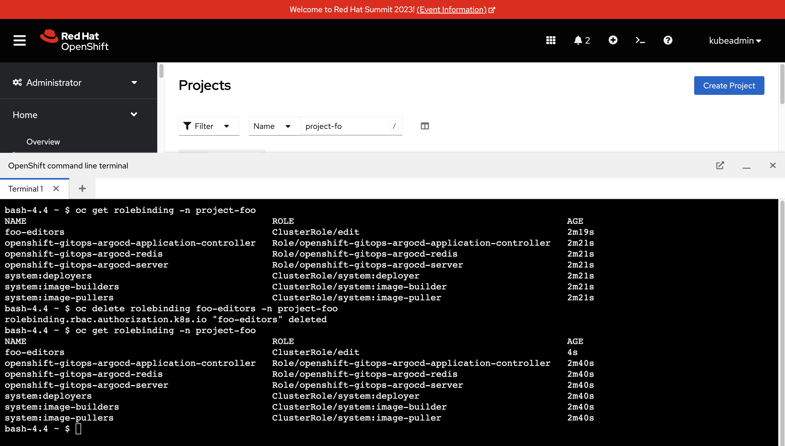

Argo CD is capable of detecting and self-healing resources when it detects configuration drift. For example, when a resource that should be present is missing it will be recreated by Argo CD. Another example is a field such as `spec.replicas` on a Deployment that has a value mismatch between what's stored in the Git repository and the actual value set on the Kubernetes cluster.

If you configure your Argo CD Application to have a `selfHeal` property set to `true` then it will automatically detect and correct configuration drift.

== Observing Argo CD Self-Healing

You have a ConsoleNotification and Namespace being managed by Argo CD. Go ahead an see what happens when you edit/delete these resources:

. Login to the OpenShift Web Console as the `opentlc-mgr` user.
. Open the OpenShift Web Terminal.
. Run the following command to delete the Console Notification:
+
[source,bash]
----
oc delete consolenotification welcome-banner
----

Depending on your timing the ConsoleNotification will briefly disappear, and then immediately reappear. This is because the *console-customisations* Application has the `selfHeal` property set to `true`.

Try a similar exercise with the RoleBinding that's managed by the *managed-namespaces* Application:

. Open the OpenShift Web Terminal.
. Run the following command to verify the RoleBinding is present. The *foo-editors* RoleBinding should be present in the output:
+
[source,bash]
----
oc get rolebinding -n project-foo
----
. Delete the *foo-editors* RoleBinding using the following command:
+
[source,bash]
----
oc delete rolebinding foo-editors -n project-foo
----
. Verify that the RoleBinding was recreated using the following command:
+
[source,bash]
----
oc get rolebinding -n project-foo
----

The RoleBinding should have been recreated automatically since the *managed-namespaces* Application has self-healing enabled.

You can see that the RoleBinding was recreated by comparing the *Age* of the RoleBinding before and after the the `oc delete` command.

== Toggling the Self-Healing Behaviour

It's possible to toggle the self-healing behaviour on and off at any time, so long as you have the necessary permissions and access to the Argo CD dashboard/resources:

. Open the Argo CD dashboard as the `admin` user.
. Select the *console-customisations* Application.
. Click the *App Details* button in the header. A modal window will appear in the dashboard.
. Scroll down and click the *Disable* button next to *Self Heal*. Click the *OK* button when asked to confirm.
+
image:images/ex5-argocd-disable-healing.png[]
. Click the *X* icon in the top-right to close the modal window.
. Return to the OpenShift Web Console, and open the OpenShift Web Terminal.
. Run the following command to delete the ConsoleNotification:
+
[source,bash]
----
oc delete consolenotification welcome-banner
----

The ConsoleNotification will disappear, and won't reappear this time. You can see that the Argo CD dashboard reports that the *console-customisations* Application is "OutOfSync". 

Use the *Sync* button to manually synchronise the Application, and consider enabling the self-healing feature for peace of mind!