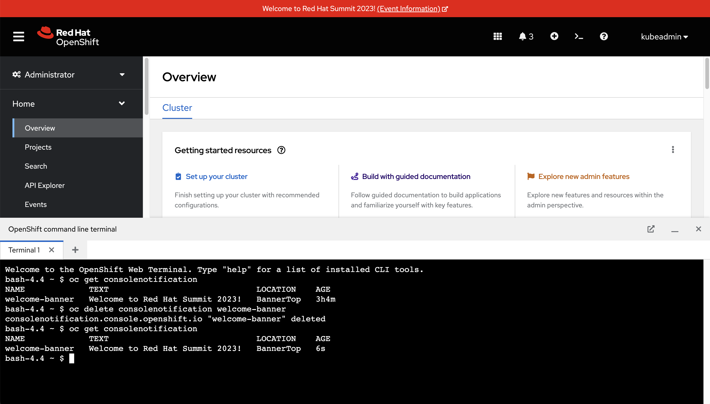
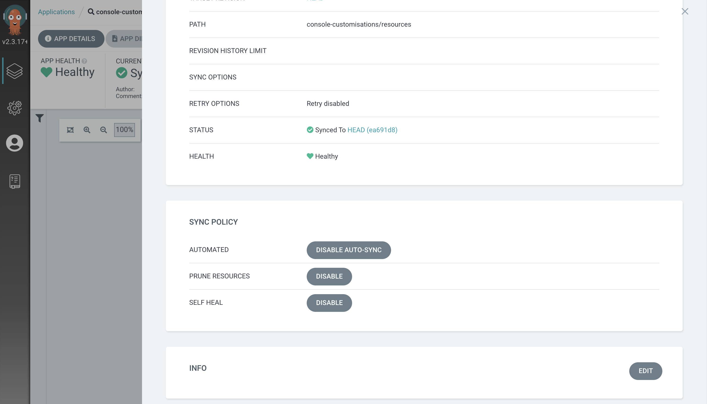

Argo CD is capable of detecting and self-healing resources when it detects configuration drift. For example, when a resource that should be present is missing it will be recreated by Argo CD. Another example is a field such as `spec.replicas` on a Deployment that has a value mismatch between what's stored in the Git repository and the actual value set on the Kubernetes cluster.

If you configure your Argo CD Application to have a `selfHeal` property set to `true` then it will automatically detect and correct configuration drift. That means if someone accidentally runs a `kubectl` command against the wrong resource Argo CD will have your back and will restore the resource to the correct configuration!

== Observing Argo CD Self-Healing

You currently have a Console Notification being managed by Argo CD. Go ahead an see what happens when you edit/delete these resources using the `oc` or `kubectl` CLI:

. Login to the OpenShift Web Console as the `opentlc-mgr` user.
. Open the OpenShift Web Terminal using the *>_* icon.
. Run the following command to list existing Console Notification resources:
+
[source,bash]
----
oc get consolenotification
----
. Run the following command to delete the `welcome-banner` Console Notification:
+
[source,bash]
----
oc delete consolenotification welcome-banner
----
. Depending on your timing the Console Notification will briefly disappear, and then immediately reappear.
+
[NOTE]
====
The reason that the Console Notification reappears is because the *console-customisations* Application in Argo CD has the `selfHeal` property set to `true`.
====
. List existing Console Notification resources again, and pay attention to the *AGE* column:
+
[source,bash]
----
oc get consolenotification
----

Did you notice that the age of the Console Notification has changed?

When you deleted the Console Notification it was automatically recreated by Argo CD. This is reflected through the new value displayed in the *AGE* column.

== Toggling the Self-Healing Behaviour

It's possible to toggle the self-healing behaviour on and off at any time, so long as you have the necessary permissions and access to the Argo CD dashboard/resources:

. Open the Argo CD dashboard and log in as the `admin` user.
. Select the *console-customisations* Application.
. Click the *App Details* button in the header. A modal window will appear in the dashboard.
. Scroll down and click the *Disable* button next to *Self Heal*. Click the *OK* button when asked to confirm.
+

. Click the *X* icon in the top-right to close the modal window.
. Return to the OpenShift Web Console, and open the OpenShift Web Terminal.
. Run the following command to delete the ConsoleNotification:
+
[source,bash]
----
oc delete consolenotification welcome-banner
----

The ConsoleNotification will disappear, and won't reappear this time. The Argo CD dashboard should be reporting that the *console-customisations* Application is "OutOfSync". 

Use the *Sync* button to manually synchronise the Application and restore the banner. Consider re-enabling the self-healing feature for peace of mind!