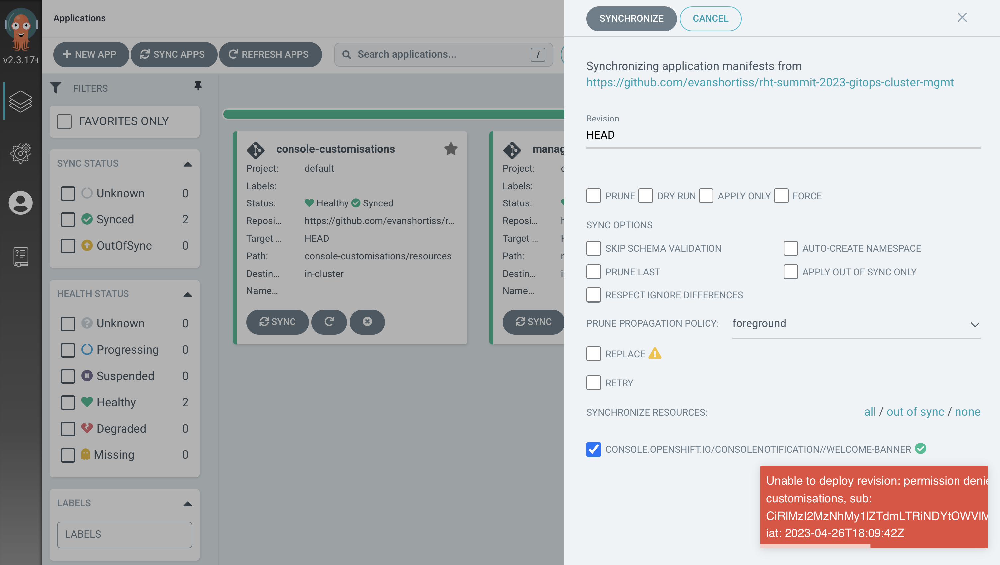
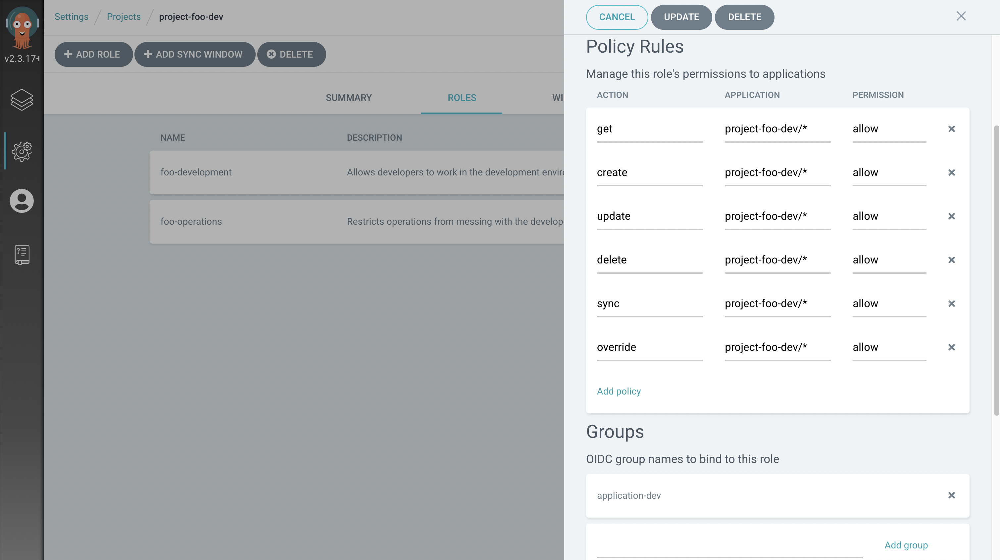

// Creating a project with custom RBAC

⏱️ _Estimated Time: 15 Minutes_

👨‍💻 _Role: Cluster Administrator_

Argo CD has a `default` project configured out of the box. This was fine for managing the cluster-scoped resources you've created so far, but separate projects are required if you want to create structured teams and environments, and enforce RBAC for Argo CD users.

In this section you'll learn how to manage user groups in OpenShift, and how to manage projects and RBAC in Argo CD.

== Login to Argo CD as a Non-Admin User

So far you've been using the `admin` user to interact with Argo CD. Try using the user `foo` instead:

. Open a private browser session in your web browser.
+
[NOTE]
====
You can start a private browser session using *File > New Incognito Window* or *File > New Private Window*. It will vary depending on your web browser of choice.
====
. Login to the OpenShift Web Console by following these steps:
    * Select the *standard-users* identity provider.
    * Enter the username: `foo`.
    * Enter the password: `foopassword`.
    * Click the *Log in* button.
. Expand the *Application Launcher* icon (3x3 sqaure) in the top-right of the OpenShift Web Console.
+
image::images/ex6.openshift-ui-argo-link.png[]
. Click the **Cluster Argo CD** link. This will open a new browser tab.
. Accept the self-signed certificate warning if one appears. The login page will now appear.
. Click the **Log in via OpenShift** button.
. Login using the same *standard-users* identity provider, the `foo` username, and the `foopassword` password you used previously when prompted.
. Click the *Allow selected permissions* button when prompted.

You should now be logged into the Argo CD dashboard as the `foo` user.

== Observing RBAC in Argo CD

Now that you've logged into Argo CD as the non-admin `foo` user, try to synchronise an Application:

. Click the *Sync* button on the *console-customisations* Application.
. Click the *Synchronize* button in the overlay that appears.

A permission denied error should appear in the bottom right corner of the screen. The text might be truncated, but it will look similar to this:

[source,plaintext]
----
Unable to deploy revision: permission denied: applications, sync, default/console-customisations
----

This error means that the current user does not have permission to perform the *sync* action on the *console-customisations* Application in the *default* Project.

Try using the *X* button on any of the Application tiles to delete them. A similar error will be returned, but instead it refers to the *delete* action:

[source,plaintext]
----
Unable to delete application: permission denied: applications, delete, default/console-customisations
----

In short, the `foo` user was automatically granted a `readonly` role. You can confirm this by using the *OpenShift Web Terminal* (in your other browser session as the `opentlc-mgr` user) to view the Argo CD RBAC configuration/policies:

[source,bash]
----
oc get cm argocd-rbac-cm -o yaml -n openshift-gitops
----

== Create a Project with Customised RBAC

Earlier in this workshop you created some managed Namespaces and applied a ResourceQuota to them, but didn't deploy any resources into those Namespaces. That's because you were acting as an administrator, configuring Namespaces and OpenShift access for development teams. 

What if those teams are using a modern development workflow and want to use Argo CD to manage the resources in their respective Namespaces? How can you make make that a reality for them? Clearly the `foo` user is unable to use Argo CD in this default state.

In this section you'll provide the `foo` user with access to their very own Project in Argo CD. This Project enables the `foo` user to manage resources in the `project-foo` Namespace. You'll do this using the https://argo-cd.readthedocs.io/en/stable/operator-manual/declarative-setup/#projects[AppProject CRD].

. Return to the browser window/session where you are logged in as the `opentlc-mgr` user.
. Run the following commands in the OpenShift Web Terminal to clone your fork of the workshop repository:
+
[source,bash]
----
export GITHUB_USERNAME=replace-this

git clone https://github.com/$GITHUB_USERNAME/rht-summit-2023-gitops-cluster-mgmt

cd rht-summit-2023-gitops-cluster-mgmt
----
. Change directory to the _rbac/groups_ directory and apply the Group resources:
+
[source,bash]
----
oc apply -f rbac/groups/group.developers.yaml -f rbac/groups/group.operations.yaml
----

Before moving on and seeing the effects of these resources, review the _https://github.com/evanshortiss/rht-summit-2023-gitops-cluster-mgmt/blob/main/argocd-projects/group.developers.yaml[group.developers.yaml]_ and _https://github.com/evanshortiss/rht-summit-2023-gitops-cluster-mgmt/blob/main/argocd-projects/group.operations.yaml[group.operations.yaml]_ files. These are simple https://docs.openshift.com/container-platform/4.12/rest_api/user_and_group_apis/group-user-openshift-io-v1.html[Group CRs] that define a list of Users that are part of a Group. The _group.developers.yaml_ file defines a Group named `application-dev` that contains just the `foo` user. The _group.operations.yaml_ file defines a Group named `application-ops` that contains just the `bar` user. 

[NOTE]
====
You could add more users to the `users` list in either of these resources if you wanted to in the future. For the purposes of this workshop we need only small groups. Realistically, you'd probably add multiple users to a group.
====

Next, take a look at the _https://github.com/evanshortiss/rht-summit-2023-gitops-cluster-mgmt/blob/main/argocd-projects/app-project.foo-dev.yaml[app-project.foo-dev.yaml]_ file - it's important and contains various comments explaining what it does! The main thing to take away is that it:

    * Creates an https://argo-cd.readthedocs.io/en/stable/operator-manual/declarative-setup/#projects[AppProject].
    * Supports multiple `destinations` (target clusters), though there's only one defined in this example; the local cluster into which it has been applied.
    * Limits the target Namespaces to `project-memes-dev` and `project-memes-prod`, and *does not* whitelist any cluster-scoped resources. This is important; we want to restrict this project to managing only resources in a the defined Namespaces and not at the cluster-level!
    * Defines two roles: `foo-development` and `foo-operations`. Users in the `application-dev` and `application-ops` Groups created previously are associated with these, respectively.
    * Defines independent RBAC policies for the `foo-development` and `foo-operations` roles.

Create the *AppProject* by returning to the OpenShift Web Terminal and applying the _app-project.foo-dev.yaml_:

[source,bash]
----
oc apply -f argocd-projects/app-project.foo-dev.yaml
----

== Verify the AppProject and RBAC Rules

Now it's time to verify the AppProject, Group, and the roles and policies were applied as expected. 

First, you'll need to log out and log in again to make sure the Group/RBAC changes are detected and applied by the Argo CD instance:

. Return to the private browser session where you had logged into the Argo CD dashboard as the `foo` user.
. Logout of the Argo CD dashboard using the *Log out* button in the top-right. The login page should be displayed.
. Click the *Log in via OpenShift* button and sign in:
    * Select the *standard-users* provider.
    * Use the username: `foo`.
    * Use the password: `foopassword`.
    * Click the *Log in* button.

Confirm that Argo CD can see that the `foo` user is a member of the `application-dev` Group:

. Click the *User Info* icon on the left-hand menu in the Argo CD dashboard.
. Confirm that the `foo` user's info shows that they're part of the `application-dev` Group:
+
image:images/ex6.argocd-user-info.png[]

Next, confirm the AppProject and roles:

. Click on the *Settings* (cog/wheel) icon on the left-hand menu in the Argo CD dashboard.
. Select *Projects* from the list of items. A `project-memes` Project should be listed.
. Click on the `project-memes` item in the Project list.
. Switch to the *Roles* tab and confirm that the `memes-development` and `memes-operations` items are listed.
. Click on the `memes-development` role. An overlay should appear.
+

. Confirm that the the *Groups* section in the overlay shows that the users in the `application-dev` Group are bound to `memes-development` role in this Argo CD (App)Project.

== Summary

In this section you learned:

* That Argo CD enforces RBAC for Projects.
* How to define custom Groups, and add OpenShift users to those Groups.
* How to create custom Projects, Roles, and Policies in Argo CD using *AppProject* CRs.

In the next section you'll learn how to implement continuous deployment for a containerised application using Argo CD.
