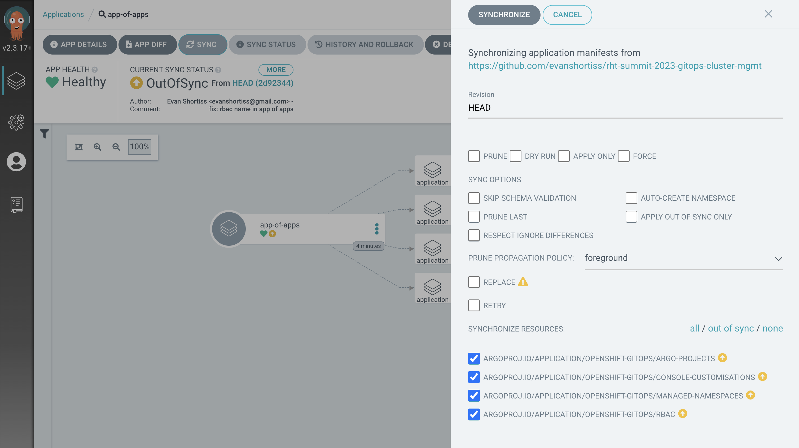
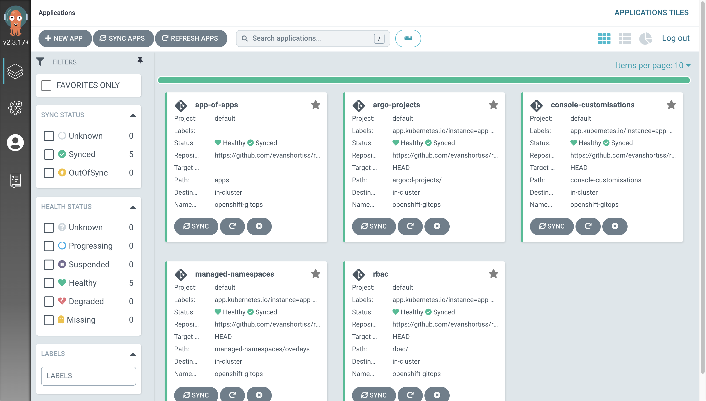
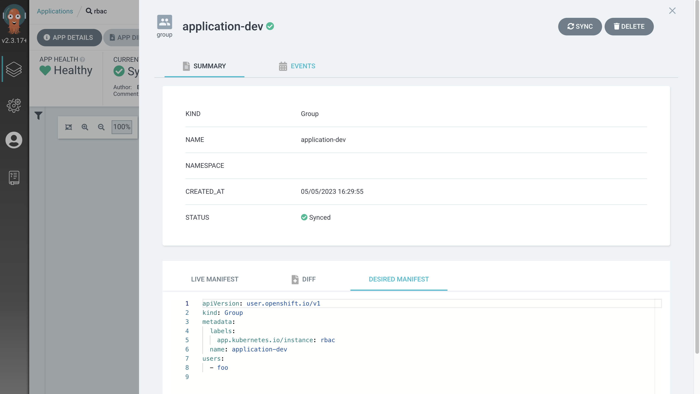
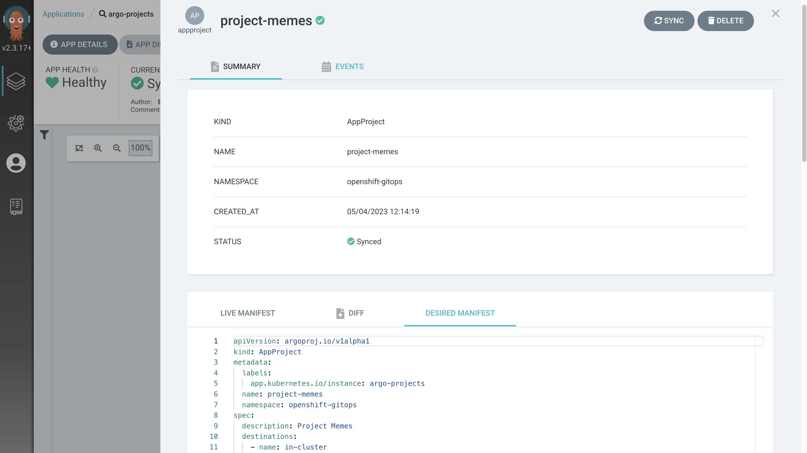
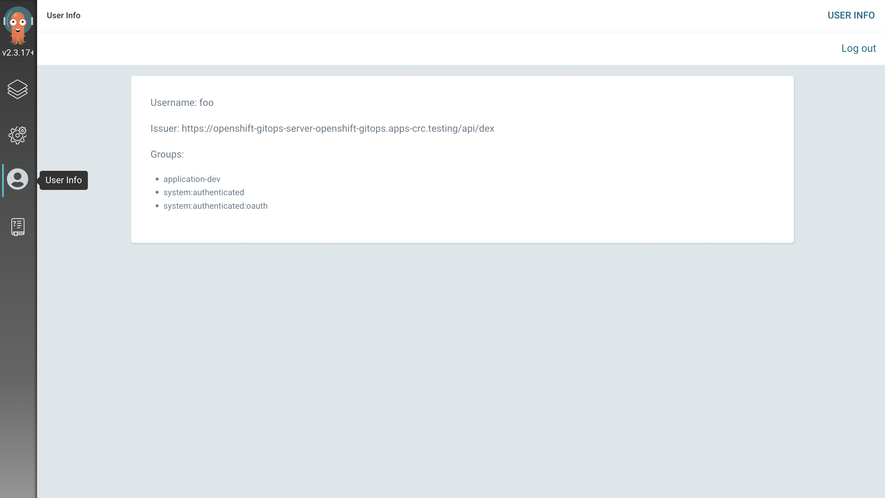
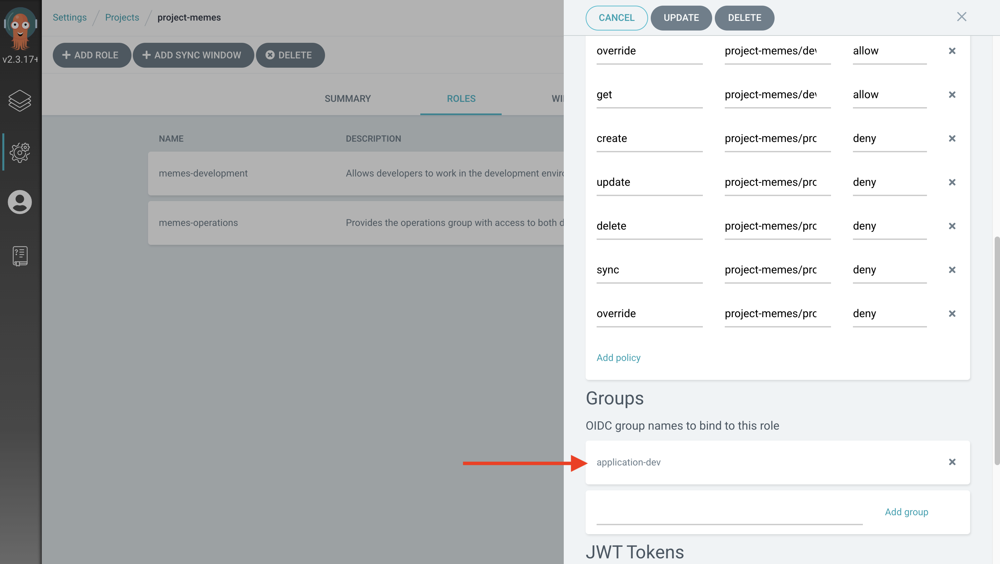

// App of Apps

⏱️ _Estimated Time: 15 Minutes_

👩‍💻 _Role: Cluster Administrator_

Earlier in this workshop you created some managed Namespaces and applied a ResourceQuota to them, but didn't deploy any resources into those Namespaces. That's because you were acting as an administrator, configuring Namespaces and OpenShift access for development teams. 

The previous section demonstrated that Argo CD has a concept of Projects, and that each Project enforces a set of RBAC policies. Enabling your development teams to use Argo CD requires creating Projects and crafting appropriate RBAC policies.

In this section you'll manage https://argo-cd.readthedocs.io/en/stable/operator-manual/declarative-setup/#projects[Argo Project CRs] and https://docs.openshift.com/container-platform/4.12/rest_api/user_and_group_apis/group-user-openshift-io-v1.html[Group CRs] using Argo CD. These CRs will enable the `foo` user to deploy their own Applications using Argo CD.

Instead of continuing to import and manage Argo CD Applications one-by-one you'll learn how to use the https://argo-cd.readthedocs.io/en/stable/operator-manual/cluster-bootstrapping/[App of Apps Pattern] to bootstrap multiple Applications at once. You'll also learn about the Argo CD CLI in the process.

== The Argo CD CLI

The Web Terminal in your environment has the Argo CD CLI pre-installed. Login to your Argo CD instance via the CLI:

. Login to the OpenShift Web Console as the `opentlc-mgr` user.
. Open the OpenShift Web Terminal using the *>_* icon.
. Verify the Argo CD CLI is available by trying to view the installed version of the CLI:
+
[source,bash]
----
argocd version
----
. Once you've confirmed the `argocd` binary is available, login to your Argo CD instance as the `admin` user:
+
[source,bash]
----
export ARGO_PASSWORD=$(kubectl get secret openshift-gitops-cluster -o json -n openshift-gitops | jq '.data["admin.password"]' -r | base64 --decode)

argocd login openshift-gitops-server.openshift-gitops.svc.cluster.local \
--insecure \
--username admin \
--password $ARGO_PASSWORD
----
. List your current Applications using the following command:
+
[source,bash]
----
argocd app list
----

The result displayed by the `argocd app list` should contain your *console-customisations* and *managed-namespaces* Applications and their status.

== Creating the App of Apps

Time to deploy the App of Apps. You can find the manifests for the App of Apps in the _apps/_ folder of *your copy* of the https://github.com/evanshortiss/rht-summit-2023-gitops-cluster-mgmt[workshop repository]. Take a look inside the _apps/_ folder; you'll see that it's a https://helm.sh/[Helm chart]. Don't worry if you're not familiar with Helm charts, it's basically a system for building fully formed YAML from a set of templates and variables/values:

. _values.yaml_ - contains a set of variables. If these look familiar it's because they are - they're values that are required by the Argo CD Application CR.
. _Chart.yaml_ - simply contains some metadata about this Helm chart.
. _templates/_ - contains a set of Application CRs that reference the variables defined in _values.yaml_.

Argo CD supports Helm charts, so you can use it to create the App of Apps from this Helm chart:

. Open *your copy* of the https://github.com/evanshortiss/rht-summit-2023-gitops-cluster-mgmt[workshop repository].
. Press the dot/period key to open the GitHub editor.
. Change the `repoURL` in _apps/templates/values.yaml_ to point to your copy.
. Use the *Source Control* tab to commit and push the change.
. Return to the Web Terminal where you logged in to your Argo CD cluster as the `admin` user and run the following command (set `GITHUB_URL` to your repository's URL) to create the new *app-of-apps* Application:
+
[source,bash]
----
export GITHUB_URL=REPLACE_THIS

argocd app create app-of-apps \
    --server openshift-gitops-server.openshift-gitops.svc.cluster.local \
    --dest-namespace openshift-gitops \
    --dest-server https://kubernetes.default.svc \
    --repo $GITHUB_URL \
    --path apps
----
+
[NOTE]
====
If the above command fails with an `Unauthenticated` error, repeat the `argocd` CLI login instructions you followed earlier.
====
. Return to the Argo CD dashboard and view the new *app-of-apps* Application. It should report that it's out of sync.
+
image:images/ex7.argo-cd-apps-out-of-sync.png[]
. Click on the *Sync* button, then click on the *Synchronize* button in the overlay that appears.
+

. Wait for the sync operation to complete, then return to the Argo CD dashboard *Applications* screen. It should look similar to the following screenshot:
+

Nice! You have configured the App of Apps. This created new *rbac* and *argo-projects* Applications that manage Argo CD Projects and OpenShift user Groups for your development teams.

== Explore your new Applications and Project with Custom RBAC

Before moving on and seeing the effects of the newly synced Application resources, review the https://github.com/evanshortiss/rht-summit-2023-gitops-cluster-mgmt/blob/main/argocd-projects/group.developers.yaml[group.developers.yaml] and https://github.com/evanshortiss/rht-summit-2023-gitops-cluster-mgmt/blob/main/argocd-projects/group.operations.yaml[group.operations.yaml] files. These are simple Group CRs that define a list of Users that are part of a Group.

[NOTE]
====
You could add more users to the `users` list in either of these resources if you wanted to in the future. For the purposes of this workshop we need only small groups. Realistically, you'd probably add multiple users to a group.
====

View these synchronised files in Argo CD:

. Login to the Argo CD dashboard as the `admin` user.
. Select the *rbac* application.
. Click the *application-dev* resource in the tree view. An overlay will appear.
. Select the *Desired Manifest* tab in the overlay.
+

This Group CR defines corresponds to the _group.developers.yaml_ file, and creates a group named *application-dev* that contains a single user named *foo*. The *application-ops* Group contains the *bar* user.

Next, take a look at the *argo-projects* Application:

. Login to the Argo CD dashboard as the `admin` user.
. Select the *argo-projects* application.
. Click the *application-dev* resource in the tree view. An overlay will appear.
. Select the *Desired Manifest* tab in the overlay.
+

This file is synchronised from the _https://github.com/evanshortiss/rht-summit-2023-gitops-cluster-mgmt/blob/main/argocd-projects/app-project.memes.yaml[argocd-projects/app-project.memes.yaml]_ in your Git repository - it's important and contains various comments explaining what it does! The main thing to take away is that it:

* Creates an https://argo-cd.readthedocs.io/en/stable/operator-manual/declarative-setup/#projects[AppProject].
* Supports multiple `destinations` (target clusters), though there's only one defined in this example; the local cluster into which it has been applied.
* Limits the target Namespaces to `project-memes-dev` and `project-memes-prod`, and *does not* whitelist any cluster-scoped resources. This is important; we want to restrict this project to managing only resources in a the defined Namespaces and not at the cluster-level!
* Defines two roles: `foo-development` and `foo-operations`. Users in the `application-dev` and `application-ops` Groups created previously are associated with these, respectively.
* Defines independent RBAC policies for the `foo-development` and `foo-operations` roles.

Now that the *rbac* and *argo-projects* Application resources are synchronised, verify they had the desired effect.

== Verify the AppProject and RBAC Rules

It's time to verify the AppProject, Group, and the roles and policies were applied as expected to the `foo` user. 

First, you'll need to log out and log in again to make sure the Group/RBAC changes are detected and applied by the Argo CD instance:

. Create a private browsing session in your web browser.
. Login to the OpenShift Web Console as the `foo` user by following these steps:
    * Select the *standard-users* identity provider.
    * Enter the username: `foo`.
    * Enter the password: `foopassword`.
    * Click the *Log in* button.
. Expand the *Application Launcher* icon (3x3 square) in the top-right of the OpenShift Web Console.
+
image::images/ex6.openshift-ui-argo-link.png[]
. Click the **Cluster Argo CD** link. This will open a new browser tab.
. Accept the self-signed certificate warning if one appears. The login page will now appear.
. Click the **Log in via OpenShift** button.
. Login using the same *standard-users* identity provider, the `foo` username, and the `foopassword` password you used previously when prompted.

Confirm that Argo CD can see that the `foo` user is a member of the `application-dev` Group:

. Click the *User Info* icon on the left-hand menu in the Argo CD dashboard.
. Confirm that the `foo` user's info shows that they're part of the `application-dev` Group:
+

Next, confirm the AppProject and roles:

. Click on the *Settings* (cog/wheel) icon on the left-hand menu in the Argo CD dashboard.
. Select *Projects* from the list of items. A `project-memes` Project should be listed.
. Click on the `project-memes` item in the Project list.
. Switch to the *Roles* tab and confirm that the `memes-development` and `memes-operations` items are listed.
. Click on the `memes-development` role. An overlay should appear.
+

. Confirm that the the *Groups* section in the overlay shows that the users in the `application-dev` group are bound to `memes-development` role in this Argo CD Project.

== Summary

Congratulations! You learned how to:

* Bootstrap a cluster with a set of Applications, templated using a Helm chart.
* Define Groups in OpenShift, and add OpenShift users to those Groups.
* Create Projects, Roles, and Policies in Argo CD using *AppProject* CRs.

In the next section you'll learn how to implement continuous deployment for a containerised application using Argo CD.
