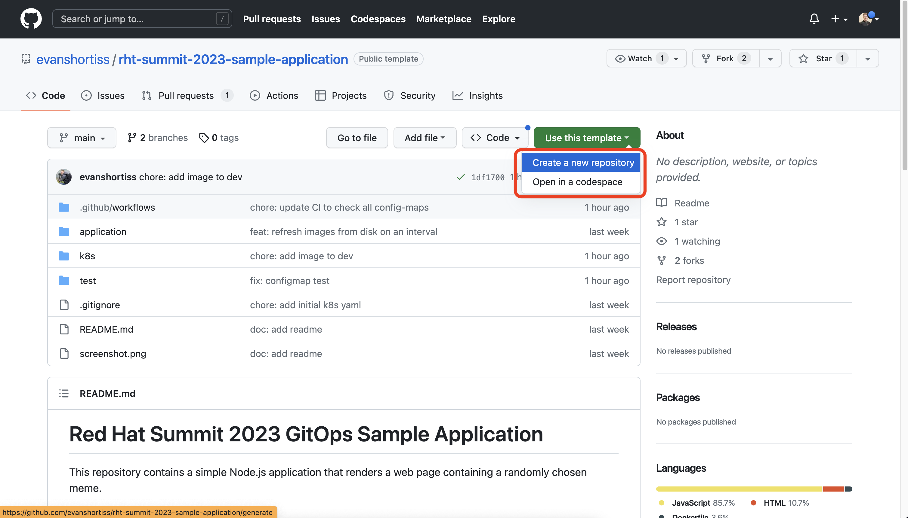
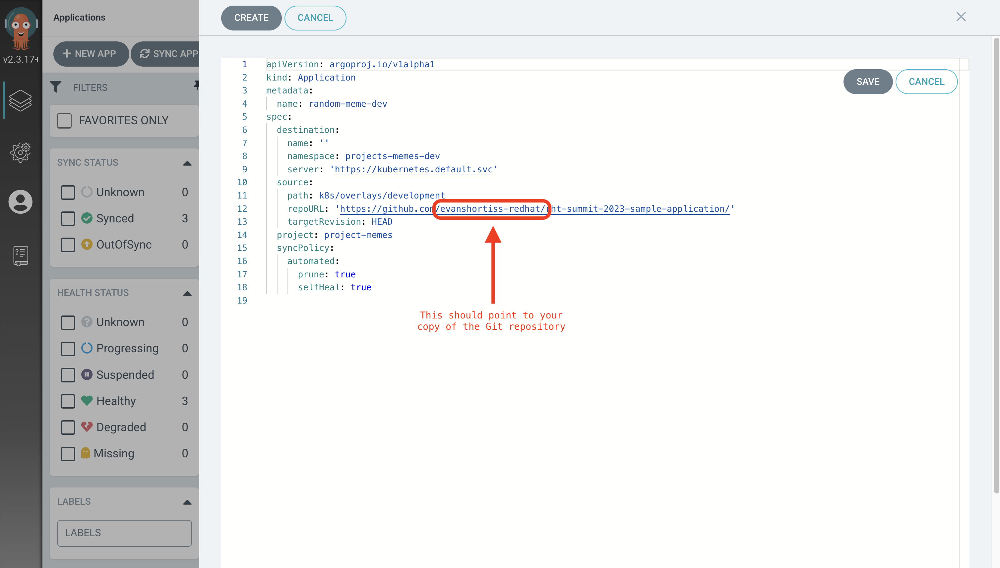

⏱️ _Estimated Time: 15 Minutes_

👨‍💻 _Role: Developer_

The moment of truth! Time to stretch your developer legs as the `foo` user, and have Argo CD continuously deploy your application into the development environment that was setup in prior sections. 

In this section you're no longer acting as a cluster administrator, but are instead acting playing the role of the `foo` developer that you've been configuring access for up to this point.

For this section of the workshop you'll be using https://github.com/evanshortiss/rht-summit-2023-sample-application[this repository on GitHub]. The linked repository contains a simple web application that renders a web page containing a randomly chosen meme. The repository also contains a set of resources in the _k8s/_ directory that will be used to deploy the application on OpenShift. You're going to deploy this application into the `project-memes-dev` namespace, then make an update to the application Git repository that runs a CI pipeline, and observe how Argo CD detects the new changes and automatically deploys them to complete the CI/CD flow.

[NOTE]
====
Separating the OpenShift/Kubernetes resources and source code for an application into separate repositories is a common approach. To reduce the number of repositories you need to manage this lab has placed both the source code and OpenShift/Kubernetes resources in this one repository.
====

== Login to Argo CD as a Developer User

If you're not already logged into the Argo CD dashboard as the `foo` user:

. Login to the OpenShift Web Console using the following steps:
    * Select the *standard-users* provider.
    * Use the username: `foo`.
    * Use the password: `foopassword`.
    * Click the *Log in* button.
. Expand the *Application Launcher* icon (3x3 sqaure) in the top-right of the OpenShift Web Console.
+

. Click the **Cluster Argo CD** link. This will open a new browser tab.
. Accept the self-signed certificate warning if one appears. The login page will now appear.
. Click the **Log in via OpenShift** button.
. Login using the same *standard-users* identity provider, the `foo` username, and the `foopassword` password you used previously.

== Create the Random Meme Application

The `foo` user now has permission to create an Application that targets the `project-memes-dev` Namespace in the `in-cluster` destination. You observed this in the prior exercise by viewing the `project-memes` in the *Projects* section in the *Settings* screen.

Create an Argo CD Application to manage your containerised random meme web application:

. Visit the https://github.com/evanshortiss/rht-summit-2023-sample-application[random-meme application repository].
. Click the *Use this template* button, and select *Create a new repository* from the list of options that are displayed.
. Enter `rht-summit-2023-sample-application` as the repository name.
+

. Navigate to the Argo CD dashboard.
. Click the *New App* button. 
. Fill in the form with the following information:
    * Application Name: `random-meme-dev`
    * Project: `project-foo-dev`
    * Sync Policy: `Automatic`
    * Prune Resources: `Enabled`
    * Self Heal: `Enabled`
    * Repository URL: `https://github.com/REPLACE_ME/rht-summit-2023-sample-application` (use your repository's URL!)
    * Path: `k8s/overlays/development`
    * Cluster URL: `https://kubernetes.default.svc`
    * Namespace: `project-memes-dev` (Using any other value will result in an error. Feel free to try a different value to see what happens!)
. After filling out these details you can switch to the YAML view and confirm that it matches this screenshot:
+

. Click the *Create* button.

The Application creation should be a success, and a new *random-meme* Application tile should be shown in the Argo CD dashboard. Clicking on the tile reveals the Application details. It should have synchronised successfully.

== Test the Containerised Application

Now that your containerised application has been deployed, go see what it does!

. Return to the OpenShift Web Console. Log in as either `foo` or `opentlc-mgr` user.
. Switch to the *Developer* perspective using the *Perspective Switcher*.
. Click the *Topology* link in the side-menu.
. Select the `project-memes-dev` from the *Project* dropdown.
. Click on the Node.js application in the topology. The application's details will appear on the right.
+

. Scroll down and click on the URL in the *Routes* section. A new browser tab will open and display a meme.
+

Excellent, you've just deployed a containerised application using Argo CD!

== Making a Code Change and Triggering the Continuous Integration (CI) Process 

Nice work on getting the application deployed on OpenShift! Now you'll make a change to the application's dev environment configuration, verify it passes CI, merge the change into the `main` branch and watch as Argo CD detects and applies the new change.

. Head over to *your copy* of the https://github.com/evanshortiss/rht-summit-2023-sample-application[random-meme application repository].
. Use the period/dot key as a shortcut to open the GitHub IDE.
. Once the GitHub IDE has loaded:
    * Click the branch name (`main` by default) in the bottom left.
    * Select *Create new branch* in the popup that appears.
    * Enter the branch name `new-meme` and press the enter key.
    * Click the green *Switch to branch* button when promoted.
. Use the following image as a guide for completing the prior steps:
+

. Add a new image to the _k8s/overlays/development/config-map.yaml_ file. You can use the URL of any image that you like.
+
[NOTE]
====
The URL of the image must resolve to an image file, and not a page that contains the image. If the URL ends in an extension such as `.png` or `.jpg` then it'll likely resolve directly to an image.
====
. Select the *Source Control* view from the side-menu.
. Enter a commit message and push your change. 
+

This new branch can be used to create a pull request. Creating the pull request will invoke a CI process, after which the code change can be merged to the `main` branch.

[NOTE]
====
It's common to use a https://trunkbaseddevelopment.com/[trunk-based development model] with Argo CD. That's why your pull request targets the `main` branch, and not a `development` or `staging` branch. The _k8s/overlays_ directory contains a unique configuration for each environment. Since the application is containerised, each of the _k8s/overlays_ (i.e environments) can be updated to point to a specific container image tag etc.
====

. Return to *your fork* of the https://github.com/evanshortiss/rht-summit-2023-sample-application[random-meme application repository].
. It should display a message that your `new-meme` branch had changes, and it suggests opening a pull request.
+

. Click on the *Compare & pull request* button.
. On the *Open a pull request* screen, scroll down and click the *Create pull request* button.
. Approve the pending checks if prompted, then wait for them to complete.
+

. Do not merge the pull request yet.

If the CI check fails, it most likely means that a URL you added to the ConfigMap doesn't resolve to an image or there's a syntax error in the JSON array in the ConfigMap. Make sure that your chosen URL returns an image and *not a page that contains an image* since that will fail the CI check. Another thing to be aware of is to make sure the image URL in the ConfigMap is surrounded by quotes, and that you haven't misplaced a comma.

Once the CI checks have passed move on to the next section.

== Observing the Continuous Deployment (CD) Process

Your pull request should be ready to merge. After merging the pull request, Argo CD will notice the changes within 3 minutes (default polling interval), and apply the new ConfigMap to your `project-foo` Namespace.

[NOTE]
====
It's possible to https://argo-cd.readthedocs.io/en/stable/operator-manual/webhook/[configure a webhook] that immediately notifies Argo CD when new changes are merged into the Git repository. This is outside of the scope of this workshop.
====

To merge your pull request:

. Open your pull request in GitHub.
. Scroll down and click on the *Merge pull request* button.
. Verify the title and commit message are to your liking, then click *Confirm merge*.

Once the pull request has been merged, take a look in the Argo CD dashboard. The new commit that you merged will show up within 3 minutes.

[NOTE]
====
You can use the *Refresh* button in Argo CD to force it to check the Git repository for changes, if you don't want to wait. If you set the sync configuration to "Automated", then as soon as the refresh completes it will trigger a sync for the new changes.
====

Once your new commit has been synchronised by Argo CD, your meme will be available to view. Follow the steps from the *Test the Containerised Application* to find the URL for your application. Refresh the page a few times and your meme will eventually be shown, all with zero downtime or manual processes beyond approving a pull request! 

You can further confirm that the new ConfigMap has been synchronised by:

. Logging into the Argo CD dashboard.
. Selecting the *random-meme* application.
. Clicking on the *images-json* ConfigMap in the *Application Details Tree*.
. Scrolling down in the overlay that appears and confirming your new image URL is listed in the *Live Manifest* YAML.

== Summary

Congratulations! You learned how to:

* Use a Argo CD to deploy a containerised application.
* Create and merge a pull request after CI checks have passed.
* Verify that Argo CD has deployed your changes as part of your CI/CD pipeline by checking the live manifest.